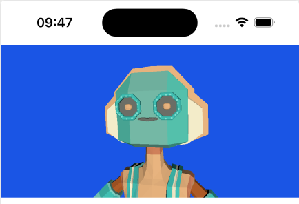

# AvatarDemo

AvatarDemo is 1-day SwiftUI-based project that integrates SceneKit and SpriteKit to create an interactive 3D avatar. The avatar responds to text input with text-to-speech (TTS) and synchronized lip movements. The project also includes head movements and animations based on specific keywords in the input text. It's free so don't complain about code and don't expect much.

## Features

- **Text-to-Speech Integration:** Uses `AVSpeechSynthesizer` to read text input aloud.
- **Synchronized Lip Movements:** Animates the avatar's facial morphers to match the spoken text.
- **Head Movements:** Simulates natural head movements and responds to specific keywords (e.g., nodding for "yes").
- **Continuous Background Animation:** Adds continuous head movements to make the avatar appear more lifelike.

## Class Structure

### ContentView
- The main SwiftUI view that contains the `SceneViewContainer` and controls for interacting with the avatar.

### SceneViewContainer
- A `UIViewRepresentable` that wraps `SCNView` to integrate SceneKit with SwiftUI.
- Contains the `Coordinator` class that manages SceneKit rendering, TTS processing, and animations.

### Coordinator
- Manages SceneKit rendering, TTS processing, and avatar animations.
- Handles notifications for changing shape keys, reading text, and head movements.

### ShapeKeyAnimator
- Manages the animation of facial morphers based on input syllables.
- Supports both asynchronous random animations and synchronous animations tied to TTS.

### TextToSpeechProcessor
- Manages TTS functionality using `AVSpeechSynthesizer`.
- Processes text input and coordinates with `ShapeKeyAnimator` to animate facial morphers.

### SyllableMapper
- Protocol for mapping syllables to specific morpher targets.
- `DefaultSyllableMapper` provides a basic implementation based on predefined mappings.

### SyllableProcessor
- Splits input text into syllables for use in TTS and lip-sync animations.
- Detects specific keywords to trigger additional animations (e.g., nodding for "yes").

## Usage

1. **Setup the Scene:**
   - The `SceneViewContainer` sets up the 3D scene, loads the avatar model, and applies materials.
   - Initializes the `ShapeKeyAnimator` and configures the TTS processor.

2. **Interact with the Avatar:**
   - Use the provided controls to trigger TTS and animations.
   - Input text to see synchronized lip movements and head animations.

3. **Continuous Animations:**
   - The avatar performs continuous head movements to simulate natural behavior.  

## Notifications

- **changeShapeKey:** Triggered to change the shape key for facial animations.
- **readText:** Triggered to start reading the input text aloud.
- **moveHeadLeft:** Moves the avatar's head to the left.
- **moveHeadRight:** Moves the avatar's head to the right.
- **performHeadNod:** Triggers the head nodding animation.
- **performHeadShaking:** Triggers the head shaking animation.

## Installation

1. Clone the repository.
2. Open the project in Xcode.
3. Build and run the project on a simulator or physical device.

## Contributing

Contributions are welcome! Please submit a pull request or open an issue to discuss any changes or improvements.

## License

This project is licensed under the MIT License.

## 3D Model
[Lalobot by poly.pizza](https://poly.pizza/bundle/100-Avatars-R2-1VwH0yHhlS)

